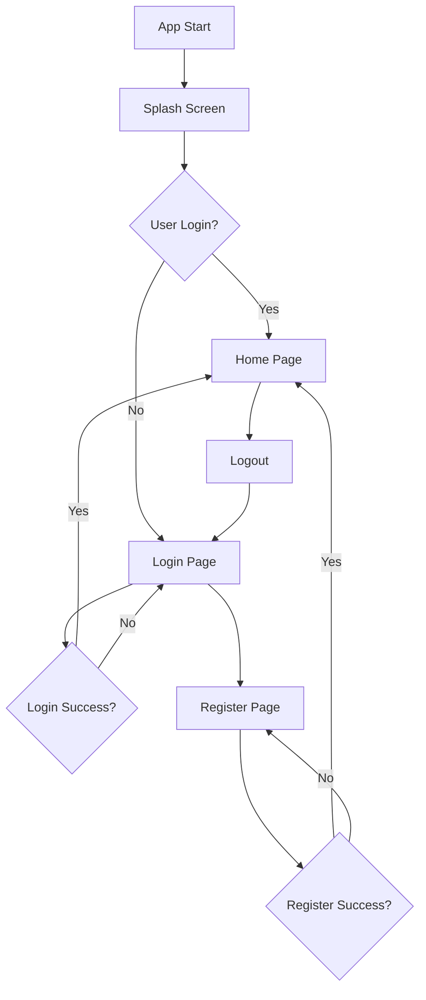
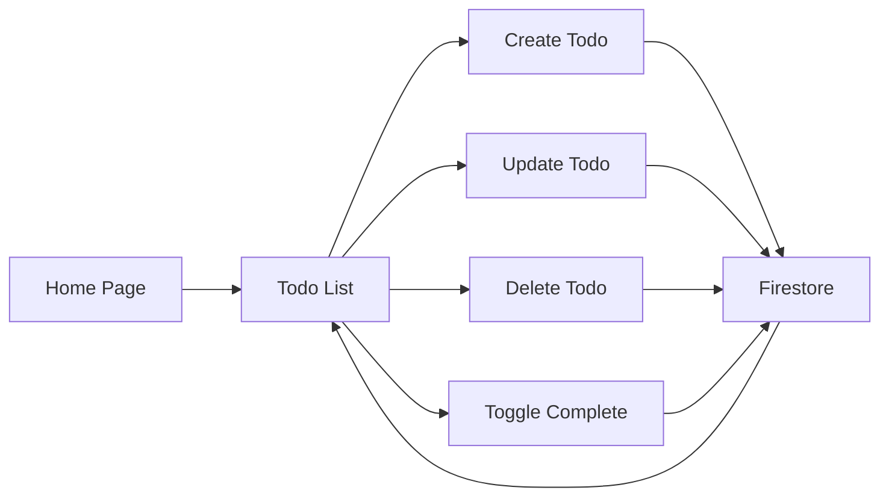

# Proyek Integrasi Firebase (LMS App)

Proyek ini adalah kelanjutan dari tugas Minggu 8 dan memenuhi tugas **Minggu 9: Integrasi Firebase**.

Tujuan utama dari tugas ini adalah mengganti _backend_ palsu (API/Dummy) dengan _backend_ yang sesungguhnya menggunakan **Firebase Authentication** dan **Cloud Firestore**.

Kami tetap menggunakan **GetX** sebagai _framework_ untuk _State Management_, _Dependency Injection_, dan _Routing_ di dalam arsitektur yang sudah ada.

---

## 📋 Daftar Isi

- [Struktur Folder Arsitektur](#-struktur-folder-arsitektur-update-minggu-9)
- [Penjelasan Detail Layer](#-penjelasan-detail-layer)
- [Dependency Injection](#-dependency-injection-di---strategi-hibrid)
- [Status Implementasi Data](#-status-implementasi-data-update-minggu-9)
- [Cara Integrasi Firestore](#-cara-integrasi-firestore-contoh-todo)
- [Prasyarat & Setup](#-prasyarat--setup)
- [Instalasi](#-instalasi)
- [Konfigurasi Firebase](#-konfigurasi-firebase)
- [Cara Menjalankan Aplikasi](#-cara-menjalankan-aplikasi)
- [Fitur Utama](#-fitur-utama)
- [Alur Kerja Aplikasi](#-alur-kerja-aplikasi)
- [Teknologi yang Digunakan](#-teknologi-yang-digunakan)
- [Struktur Database Firestore](#-struktur-database-firestore)
- [Testing](#-testing)
- [Troubleshooting](#-troubleshooting)
- [Roadmap](#-roadmap)
- [Kontributor](#-kontributor)

---

## 📁 Struktur Folder Arsitektur (Update Minggu 9)

Struktur folder kita telah diperbarui untuk mencerminkan penambahan fitur Autentikasi dan penggantian _backend_ Todo.

```text
└── lib/
    ├── main.dart                 (<- Titik masuk, Inisialisasi Firebase & Get.put Auth)
    ├── README.md                 (<- Dokumentasi ini)
    └── app/
        ├── presentation/         (<- 1. LAYER UI)
        │   ├── widgets/            (<- Komponen UI)
        │   ├── pages/              (<- Halaman/Layar)
        │   │   ├── account_page.dart
        │   │   ├── home_page.dart
        │   │   ├── login_page.dart         (<- Direfaktor untuk AuthController)
        │   │   ├── main_content_page.dart
        │   │   ├── register_page.dart      (<- Direfaktor untuk AuthController)
        │   │   ├── splash_page.dart        (<- BARU: Pintu gerbang navigasi)
        │   │   ├── todo/
        │   │   └── course/
        │   └── controllers/        (<- "Otak" UI)
        │       ├── auth_controller.dart    (<- BARU: Manajer Keamanan Global)
        │       ├── class_controller.dart
        │       └── todo_controller.dart
        │
        ├── domain/                 (<- 2. LAYER DOMAIN)
        │   ├── repositories/       (<- Kontrak/Buku Menu)
        │   │   ├── i_auth_repository.dart    (<- BARU)
        │   │   ├── i_course_repository.dart
        │   │   └── i_todo_repository.dart
        │   ├── entities/           (<- Model data murni)
        │   └── usecases/           (<- Resep/Tugas)
        │       ├── auth/                 (<- BARU)
        │       │   ├── login_use_case.dart
        │       │   ├── logout_use_case.dart
        │       │   └── register_use_case.dart
        │       ├── todo/
        │       └── course/
        │
        ├── data/                   (<- 3. LAYER DATA)
        │   ├── repositories/       (<- "Kepala Koki" / Implementasi)
        │   │   ├── auth_repository_impl.dart (<- BARU)
        │   │   ├── course_repository_impl.dart
        │   │   └── todo_repository_impl.dart
        │   └── datasources/        (<- "Supplier" / Sumber Data)
        │       ├── auth_firebase_data_source.dart (<- BARU)
        │       ├── course_dummy_data_source.dart
        │       └── todo_firestore_data_source.dart  (<- MENGGANTIKAN todo_remote_data_source)
        │
        └── core/                   (<- 4. LAYER CORE)
            ├── routes/             (<- Peta navigasi)
            │   └── app_routes.dart
            └── bindings/           (<- Penyuntik dependensi fitur)
                ├── class_binding.dart
                └── todo_binding.dart
                (Catatan: AuthBinding dihapus, diganti Get.put di main.dart)
```

---

## 🏛️ Penjelasan Detail Layer

### 1. Presentation Layer (`lib/app/presentation`)

Layer ini tidak berubah secara konsep, tetapi telah diperbarui:

- **`pages/`**: Menambahkan `splash_page.dart` sebagai gerbang navigasi utama.
- **`pages/login_page.dart` & `register_page.dart`**: Direfaktor total. State lokal `_isLoading` dihapus dan diganti dengan `Obx` yang "mendengarkan" `isLoading` dari `AuthController`.
- **`controllers/`**: Menambahkan `auth_controller.dart` sebagai controller global untuk mengelola status login.

---

### 2. Domain Layer (`lib/app/domain`)

Layer ini diperluas untuk mencakup logika bisnis Autentikasi.

- **`entities/`**: `todo.dart` dan `course.dart` tidak berubah.
- **`repositories/`**: Menambahkan `i_auth_repository.dart` sebagai "kontrak" yang mendefinisikan apa yang bisa dilakukan oleh sistem Auth (contoh: `loginWithEmail`, `registerWithEmail`, `logout`, `authStateChanges`).
- **`usecases/`**: Menambahkan folder `auth/` dengan use case spesifik seperti `LoginUseCase`, `RegisterUseCase`, dan `LogoutUseCase`.

---

### 3. Data Layer (`lib/app/data`)

Ini adalah layer dengan perubahan terbesar, di mana kita "menukar" backend.

- **`datasources/`**:
  - **Dihapus**: `todo_remote_data_source.dart` (Supplier API).
  - **Ditambahkan**: `auth_firebase_data_source.dart` (Supplier yang tahu cara bicara dengan Firebase Auth).
  - **Ditambahkan**: `todo_firestore_data_source.dart` (Supplier yang tahu cara bicara dengan Cloud Firestore).
  - **Perubahan Kunci (Isolasi Data)**: `TodoFirestoreDataSource` kini menggunakan `_auth.currentUser?.uid` untuk memastikan semua query (Get, Create, Update, Delete) hanya terjadi di dalam path `users/{userId}/todos/{todoId}`. Ini menjamin data todo terisolasi per user.

---

### 4. Core Layer (`lib/app/core`)

Layer ini disederhanakan.

- **`routes/app_routes.dart`**: `initialRoute` diubah ke `/splash`. Kami menghapus semua `AuthBinding` dari rute `/login`, `/register`, dan `/home` untuk mencegah konflik.
- **`bindings/`**: `AuthBinding` dihapus. `TodoBinding` dan `ClassBinding` tetap ada.

---

## 💉 Dependency Injection (DI) - Strategi Hibrid

Kami mengadopsi strategi DI hibrid untuk stabilitas:

### Untuk Global Service (Auth):

Kami menggunakan `Get.put(AuthController(...), permanent: true)` langsung di `main.dart`.

**Mengapa?** Ini adalah solusi untuk bug "stuck di splash". Ini menciptakan satu instance `AuthController` yang permanen sebelum aplikasi berjalan, memastikan listener status login selalu aktif dan stabil.

### Untuk Feature Controller (Todo & Course):

Kami tetap menggunakan Bindings (`TodoBinding`, `ClassBinding`) yang terikat pada rute `/home`.

**Mengapa?** Ini adalah _best practice_ untuk _lazy loading_. `TodoController` (dan semua dependencies-nya) hanya dimuat ke memori saat user benar-benar masuk ke `/home`, menghemat sumber daya.

---

## ✅ Status Implementasi Data (Update Minggu 9)

### 🔹 Modul Auth (BARU)

Telah sepenuhnya terhubung ke **Firebase Authentication**. Halaman Login, Register, dan Account (Logout) berfungsi penuh.

### 🔹 Modul Todo (MIGRASI)

Telah dimigrasi dari API ke **Cloud Firestore**. Data sekarang persisten dan terisolasi per user.

### 🔹 Modul Course (TIDAK BERUBAH)

Masih menggunakan data dummy melalui `CourseDummyDataSource`.

---

## ⚙️ Cara Integrasi Firestore (Contoh: Todo)

Ini adalah implementasi final di `TodoBinding`, menunjukkan bagaimana kami menukar supplier data.

```dart
// File: lib/app/core/bindings/todo_binding.dart

// 1. Daftarkan Supplier Firestore (BARU)
Get.lazyPut<TodoFirestoreDataSource>(
  () => TodoFirestoreDataSource(),
  fenix: true,
);

// 2. Daftarkan Kepala Koki (Repo) dan suntik dengan Supplier BARU
Get.lazyPut<ITodoRepository>(
  () => TodoRepositoryImpl(Get.find<TodoFirestoreDataSource>()), // <-- Diubah
  fenix: true,
);

// 3. (Daftarkan Resep & Manajer seperti biasa...)
```

---

## 🔧 Prasyarat & Setup

Sebelum menjalankan proyek ini, pastikan Anda telah menginstal:

### Software yang Diperlukan:

- **Flutter SDK** (versi 3.0.0 atau lebih baru)
- **Dart SDK** (versi 2.17.0 atau lebih baru)
- **Android Studio** / **VS Code** dengan plugin Flutter
- **Git**
- **Firebase CLI** (opsional, untuk deployment)

### Akun yang Diperlukan:

- Akun **Google** untuk mengakses Firebase Console
- Proyek **Firebase** yang sudah dikonfigurasi

---

## 📦 Instalasi

### 1. Clone Repository

```bash
git clone https://github.com/username/lms-app-firebase.git
cd lms-app-firebase
```

### 2. Install Dependencies

```bash
flutter pub get
```

### 3. Verifikasi Instalasi Flutter

```bash
flutter doctor
```

Pastikan tidak ada issues kritis (tanda ✗).

---

## 🔥 Konfigurasi Firebase

### Langkah 1: Buat Proyek Firebase

1. Buka [Firebase Console](https://console.firebase.google.com/)
2. Klik **"Add project"** atau **"Tambah proyek"**
3. Beri nama proyek (contoh: `lms-app`)
4. Ikuti wizard setup hingga selesai

### Langkah 2: Tambahkan Aplikasi ke Firebase

#### Untuk Android:

1. Di Firebase Console, pilih **"Add app"** → **Android**
2. Masukkan **Android package name** (cek di `android/app/build.gradle`, biasanya `com.example.lms_app`)
3. Download file `google-services.json`
4. Letakkan file tersebut di folder `android/app/`

5. Tambahkan dependency di `android/build.gradle`:

```gradle
buildscript {
    dependencies {
        // ... dependensi lain
        classpath 'com.google.gms:google-services:4.3.15'
    }
}
```

6. Tambahkan plugin di `android/app/build.gradle`:

```gradle
apply plugin: 'com.google.gms.google-services'
```

#### Untuk iOS (opsional):

1. Di Firebase Console, pilih **"Add app"** → **iOS**
2. Masukkan **iOS bundle ID** (cek di Xcode)
3. Download file `GoogleService-Info.plist`
4. Tambahkan file ke Xcode project (folder `Runner`)

### Langkah 3: Aktifkan Firebase Authentication

1. Di Firebase Console, buka menu **Authentication**
2. Klik tab **"Sign-in method"**
3. Aktifkan metode **Email/Password**
4. Klik **"Enable"** → **"Save"**

### Langkah 4: Buat Database Firestore

1. Di Firebase Console, buka menu **Firestore Database**
2. Klik **"Create database"**
3. Pilih mode:
   - **Test mode** (untuk development): Data dapat dibaca/tulis tanpa autentikasi
   - **Production mode** (recommended): Gunakan security rules
4. Pilih lokasi server (contoh: `asia-southeast1`)
5. Klik **"Enable"**

### Langkah 5: Setup Security Rules (Production Mode)

Tambahkan rules berikut di **Firestore Rules**:

```javascript
rules_version = '2';
service cloud.firestore {
  match /databases/{database}/documents {
    // Rule untuk koleksi users/{userId}/todos
    match /users/{userId}/todos/{todoId} {
      allow read, write: if request.auth != null && request.auth.uid == userId;
    }

    // Block akses ke koleksi lain
    match /{document=**} {
      allow read, write: if false;
    }
  }
}
```

**Penjelasan Rules:**

- User hanya bisa baca/tulis data todo mereka sendiri
- Akses hanya diberikan untuk user yang sudah login (`request.auth != null`)
- User ID di path harus sama dengan User ID yang login (`request.auth.uid == userId`)

---

## 🚀 Cara Menjalankan Aplikasi

### Mode Development

```bash
# Jalankan di emulator/device
flutter run

# Jalankan dengan hot reload
flutter run --debug

# Pilih device spesifik
flutter run -d <device_id>
```

### Mode Release (Production)

```bash
# Build APK untuk Android
flutter build apk --release

# Build App Bundle untuk Play Store
flutter build appbundle --release

# Build untuk iOS
flutter build ios --release
```

---

## ✨ Fitur Utama

### 1. 🔐 Autentikasi (Firebase Authentication)

- ✅ **Register** dengan Email & Password
- ✅ **Login** dengan Email & Password
- ✅ **Logout** dengan konfirmasi
- ✅ **Persistent Login** (auto-login saat buka app)
- ✅ **Validasi Form** (email format, password minimal 6 karakter)
- ✅ **Error Handling** dengan pesan yang user-friendly

### 2. ✅ Todo Management (Cloud Firestore)

- ✅ **Create** Todo dengan judul dan deskripsi
- ✅ **Read** Daftar Todo (real-time sync)
- ✅ **Update** Todo (edit judul/deskripsi)
- ✅ **Delete** Todo dengan konfirmasi
- ✅ **Toggle Complete** status todo
- ✅ **Data Isolation**: Setiap user hanya bisa akses todo mereka sendiri

### 3. 📚 Course/Class Management (Dummy Data)

- ✅ **Daftar Kelas** dengan kategori
- ✅ **Detail Kelas** dengan deskripsi lengkap
- 📝 _Belum terintegrasi dengan Firebase_

### 4. 👤 Account Page

- ✅ Tampilkan **Email** user yang login
- ✅ Tombol **Logout** dengan konfirmasi dialog

---

## 🔄 Alur Kerja Aplikasi

### Flow Autentikasi:



### Flow Todo CRUD:



---

## 🛠️ Teknologi yang Digunakan

| Teknologi           | Versi  | Fungsi                        |
| ------------------- | ------ | ----------------------------- |
| **Flutter**         | 3.x    | Framework UI                  |
| **Dart**            | 2.17+  | Bahasa Pemrograman            |
| **GetX**            | 4.x    | State Management, DI, Routing |
| **Firebase Auth**   | Latest | Autentikasi User              |
| **Cloud Firestore** | Latest | Database NoSQL                |
| **Firebase Core**   | Latest | Inisialisasi Firebase         |

### Dependencies Utama (`pubspec.yaml`):

```yaml
dependencies:
  flutter:
    sdk: flutter
  get: ^4.6.5
  firebase_core: ^2.24.0
  firebase_auth: ^4.16.0
  cloud_firestore: ^4.14.0
```

---

## 📊 Struktur Database Firestore

### Collection: `users`

```
users (collection)
  └── {userId} (document)
      └── todos (sub-collection)
          └── {todoId} (document)
              ├── title: string
              ├── description: string
              ├── isCompleted: boolean
              └── createdAt: timestamp
```

### Contoh Data:

```json
{
  "users": {
    "abc123xyz": {
      "todos": {
        "todo_001": {
          "title": "Belajar Flutter",
          "description": "Menyelesaikan modul Firebase",
          "isCompleted": false,
          "createdAt": "2024-01-15T10:30:00Z"
        },
        "todo_002": {
          "title": "Mengerjakan Tugas",
          "description": "Tugas Minggu 9",
          "isCompleted": true,
          "createdAt": "2024-01-14T08:00:00Z"
        }
      }
    }
  }
}
```

---

## 🧪 Testing

### Unit Test (Coming Soon)

```bash
# Jalankan semua test
flutter test

# Jalankan test dengan coverage
flutter test --coverage
```

### Integration Test (Coming Soon)

```bash
# Jalankan integration test
flutter drive --target=test_driver/app.dart
```

### Manual Testing Checklist:

#### Autentikasi:

- [ ] Register dengan email valid
- [ ] Register dengan email tidak valid (harus error)
- [ ] Register dengan password < 6 karakter (harus error)
- [ ] Login dengan akun yang sudah terdaftar
- [ ] Login dengan kredensial salah (harus error)
- [ ] Logout dari aplikasi
- [ ] Buka aplikasi lagi (harus auto-login jika sudah login sebelumnya)

#### Todo Management:

- [ ] Tambah todo baru
- [ ] Edit todo yang sudah ada
- [ ] Hapus todo
- [ ] Toggle status complete/incomplete
- [ ] Reload aplikasi (data harus tetap ada)
- [ ] Login dengan user berbeda (harus melihat data berbeda)

---

## 🐛 Troubleshooting

### Problem: "Stuck di Splash Screen"

**Solusi:**

- Pastikan `AuthController` di-inject di `main.dart` sebelum `runApp()`
- Gunakan `Get.put(..., permanent: true)` bukan `Get.lazyPut()`

### Problem: "Firebase not initialized"

**Solusi:**

```dart
// Pastikan di main.dart:
void main() async {
  WidgetsFlutterBinding.ensureInitialized();
  await Firebase.initializeApp(); // <-- INI PENTING
  runApp(MyApp());
}
```

### Problem: "google-services.json not found"

**Solusi:**

- Download ulang dari Firebase Console
- Pastikan file ada di `android/app/google-services.json`
- Jalankan `flutter clean` → `flutter pub get`

### Problem: "Permission denied" di Firestore

**Solusi:**

- Cek Firestore Rules di Firebase Console
- Pastikan rules mengizinkan akses untuk user yang login
- Untuk testing, bisa gunakan test mode (TIDAK untuk production)

### Problem: Data Todo tidak muncul setelah login

**Solusi:**

- Cek apakah `userId` sudah benar di Firestore path
- Gunakan Firebase Console untuk verifikasi data
- Cek log console untuk error message

### Problem: Build gagal di Android

**Solusi:**

```bash
# Clean project
flutter clean

# Hapus build folder
rm -rf android/build
rm -rf android/app/build

# Re-build
flutter pub get
flutter build apk
```

---
